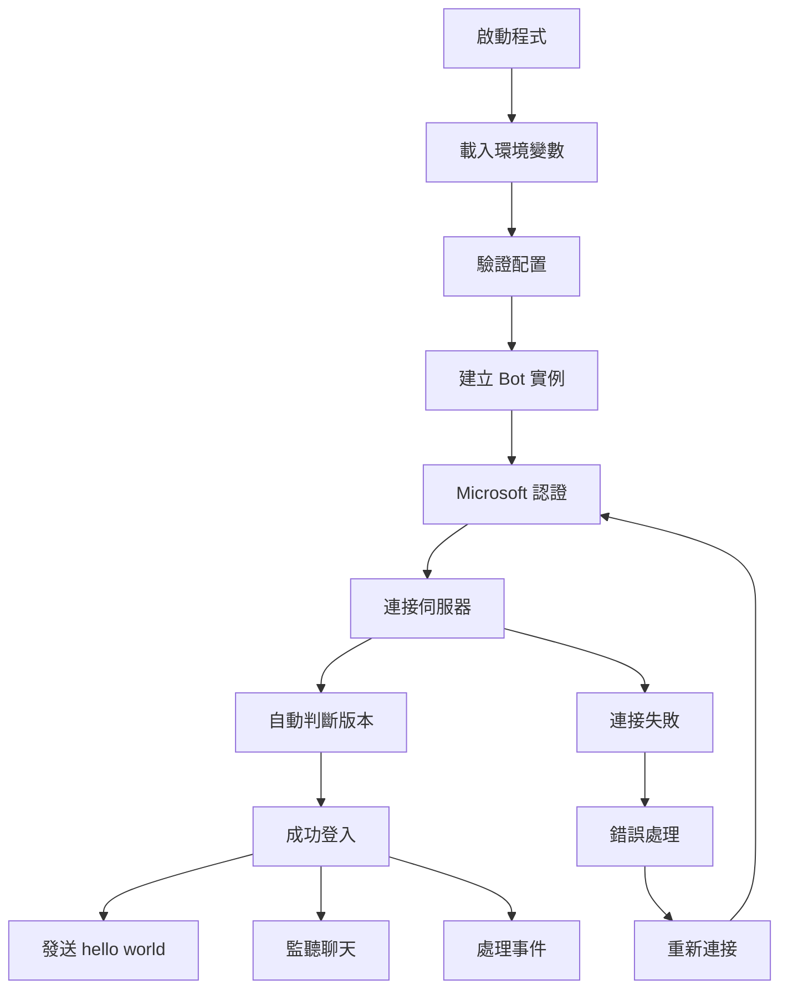

# AIK Minecraft Bot

一個使用 mineflayer 框架開發的 Minecraft 機器人，支援 Microsoft 帳號認證、自動版本判斷及基本聊天功能。

## 📋 專案概述

本專案旨在建立一個簡單但功能完整的 Minecraft bot，具備以下特色：
- **Microsoft 帳號認證**: 使用您的 Microsoft 帳號安全登入
- **自動版本判斷**: 自動偵測並適配伺服器的 Minecraft 版本
- **基本聊天功能**: 登入後會在聊天頻道發送 "hello world" 訊息
- **智能重連機制**: 當連線中斷時自動嘗試重新連接
- **詳細日誌系統**: 提供完整的運行狀態記錄

## 🚀 快速開始

### 系統需求

- **Node.js**: 版本 21.0.0 或更高
- **npm**: 隨 Node.js 一起安裝
- **Minecraft 帳號**: 擁有正版 Microsoft 帳號的 Minecraft Java Edition

### 安裝步驟

1. **克隆專案**
   ```bash
   git clone <repository-url>
   cd AIK-bot
   ```

2. **設定 Node.js 版本**
   ```bash
   nvm use
   ```
   
   > ⚠️ **重要**: 請在每次開發前都執行 `nvm use` 確保使用正確的 Node.js 版本 (22.17.1)

3. **安裝依賴套件**
   ```bash
   npm install
   ```

4. **配置環境變數**
   ```bash
   # 複製環境變數範本
   cp env.example .env
   
   # 編輯 .env 檔案，填入您的資訊
   nano .env
   ```

5. **設定您的 Microsoft 帳號**
   
   在 `.env` 檔案中填入以下資訊：
   ```
   MINECRAFT_EMAIL=your-microsoft-email@example.com
   MINECRAFT_PASSWORD=your-password
   MINECRAFT_SERVER_HOST=localhost
   MINECRAFT_SERVER_PORT=25565
   BOT_USERNAME=MyBot
   ```

6. **啟動 Bot**
   ```bash
   npm start
   ```

### 開發模式

如果您要進行開發或測試，請先確認 Node.js 版本，然後使用開發模式：
```bash
# 確保使用正確的 Node.js 版本
nvm use

# 啟動開發模式
npm run dev
```

開發模式使用 nodemon 監視檔案變更，當程式碼修改時會自動重啟 bot。如需詳細輸出，可使用 `npm run dev:verbose`。

> 💡 **開發提示**: 每次開啟新的終端視窗時，請記得執行 `nvm use` 以確保版本一致性。

### 可用的 npm 腳本

| 指令 | 說明 |
|------|------|
| `npm start` | 啟動 bot (生產模式) |
| `npm run dev` | 開發模式 (使用 nodemon 自動重啟) |
| `npm run dev:verbose` | 開發模式 (詳細輸出) |
| `npm run clean` | 清除 node_modules 和 package-lock.json |
| `npm run reinstall` | 重新安裝所有依賴套件 |

## 📁 專案架構

```
AIK-bot/
├── .env                 # 環境變數 (不提交到 git)
├── .nvmrc              # Node.js 版本控制檔案
├── env.example         # 環境變數範本
├── .gitignore          # Git 忽略檔案
├── package.json        # Node.js 專案設定
├── index.js            # 主程式入口
├── README.md           # 本說明文件
├── spec.md             # 專案規格文件
├── CHANGELOG.md        # 版本更新記錄
└── .cursorrules        # 開發規範
```

## 🔧 核心模組說明

### 主程式 (index.js)

主程式包含以下核心功能：

- **配置管理**: 從環境變數載入 bot 配置
- **認證處理**: Microsoft 帳號登入和驗證
- **Bot 生命週期**: 建立、連接、重連邏輯
- **事件處理**: 聊天、錯誤、踢出等事件
- **日誌系統**: 結構化的日誌記錄

### 資料流程



## ⚙️ 配置選項

### 環境變數說明

| 變數名稱 | 必填 | 預設值 | 說明 |
|---------|------|--------|------|
| `MINECRAFT_EMAIL` | ✅ | - | Microsoft 帳號郵箱 |
| `MINECRAFT_PASSWORD` | ✅ | - | Microsoft 帳號密碼 |
| `MINECRAFT_SERVER_HOST` | ❌ | localhost | 目標伺服器地址 |
| `MINECRAFT_SERVER_PORT` | ❌ | 25565 | 目標伺服器端口 |
| `BOT_USERNAME` | ❌ | MyBot | Bot 在遊戲中的暱稱 |
| `LOG_LEVEL` | ❌ | info | 日誌等級 |

## 🛠️ 功能特色

### Microsoft 認證
- 使用官方 Microsoft 認證流程
- 安全的密碼管理（不會明文儲存）
- 自動處理認證失敗情況

### 版本自動判斷
- 自動偵測伺服器的 Minecraft 版本
- 支援主流版本（1.8 - 1.21）
- 無需手動設定版本號

### 智能重連
- 網路中斷自動重連
- 伺服器踢出後重連
- 漸進式重連延遲

### 日誌系統
- 時間戳記格式化
- 分級日誌記錄
- 結構化錯誤信息

## 🔍 故障排除

### 常見問題

**Q: Bot 無法連接到伺服器？**
A: 請檢查以下項目：
- 伺服器地址和端口是否正確
- 伺服器是否正在運行
- 網路連接是否正常
- 防火牆設定是否阻擋連接

**Q: Microsoft 認證失敗？**
A: 可能的原因：
- 帳號或密碼錯誤
- 帳號啟用了兩步驟驗證
- 帳號未購買 Minecraft Java Edition
- 網路連接問題

**Q: Bot 登入後立即被踢出？**
A: 可能的原因：
- 伺服器不允許相同用戶名
- 伺服器有白名單限制
- 伺服器版本不相容

### 日誌分析

查看程式輸出的日誌信息，通常會包含錯誤的詳細描述。常見的日誌格式：
```
[2024-01-XX] [INFO] Bot 已成功登入並生成在世界中！
[2024-01-XX] [ERROR] Bot 發生錯誤: Invalid credentials
```

## 🔒 安全性注意事項

1. **永遠不要將 `.env` 檔案提交到版本控制系統**
2. **定期更換密碼**
3. **不要在公共場所展示含有帳號信息的畫面**
4. **考慮使用專用的 bot 帳號**

## 📝 開發指南

### 代碼風格
- 使用 ES6+ 語法
- 優先使用 ES Modules (import/export)
- 使用 async/await 處理異步操作
- 適當的錯誤處理和日誌記錄

### 擴展功能
如果您想要擴展 bot 的功能，可以在主程式中添加更多事件監聽器：

```javascript
// 監聽玩家加入
bot.on('playerJoined', (player) => {
    bot.chat(`歡迎 ${player.username} 加入伺服器！`);
});

// 監聽私人訊息
bot.on('whisper', (username, message) => {
    console.log(`${username} 私訊: ${message}`);
});
```

## 🤝 貢獻指南

歡迎提交 Issue 和 Pull Request！請遵循以下規範：

1. 提交前請先測試您的更改
2. 遵循現有的代碼風格
3. 更新相關文檔
4. 使用有意義的 commit 訊息

## 📄 授權條款

本專案採用 MIT 授權條款。詳細信息請參閱 LICENSE 檔案。

## 🔗 相關資源

- [Mineflayer 官方文檔](https://github.com/PrismarineJS/mineflayer)
- [Node.js 官方網站](https://nodejs.org/)
- [Minecraft 官方網站](https://www.minecraft.net/)

---

**注意**: 本專案僅供學習和研究用途。請遵守 Minecraft 服務條款和相關伺服器規則。 

## 🛠️ 故障排除 (Troubleshooting)

### 已知問題與解決方案

#### Mineflayer 聊天功能崩潰問題

**問題描述**: 
Bot 在處理聊天訊息時崩潰，錯誤訊息：
```
TypeError [ERR_INVALID_ARG_TYPE]: The "list" argument must be an instance of Array. Received an instance of Buffer
    at Function.concat (node:buffer:579:3)
    at updateAndValidateSession (node_modules\minecraft-protocol\src\client\chat.js:61:114)
```

**影響版本**: 
- mineflayer: 4.30.0
- minecraft-protocol: 相關版本
- Node.js: 22.17.1

**原因**: 
minecraft-protocol 庫在處理聊天訊息簽名驗證時，預期收到 Array 但實際收到了 Buffer。

**解決方案**: 

**方案 1: 暫時停用聊天監聽器 (目前採用)**
```javascript
// 暫時註解掉聊天監聽器，避免崩潰
// bot.on('chat', (username, message) => {
//     // 聊天相關處理
// });
```

**方案 2: 修補 minecraft-protocol 庫**
修改 `node_modules/minecraft-protocol/src/client/chat.js` 第 61 行：
```javascript
// 原始程式碼 (有問題)
const acknowledgements = previousMessages.length > 0 ? ['i32', previousMessages.length, 'buffer', Buffer.concat(previousMessages.map(msg => msg.signature || client._signatureCache[msg.id]))] : ['i32', 0]

// 修正程式碼 (臨時修復)
const acknowledgements = previousMessages.length > 0 ? ['i32', previousMessages.length, 'buffer', Buffer.concat(previousMessages.map(msg => msg.signature || client._signatureCache[msg.id]).filter(buf => Buffer.isBuffer(buf)))] : ['i32', 0]
```

**相關資源**: 
- GitHub Issue: [Bot crashes after multiple chats #3703](https://github.com/PrismarineJS/mineflayer/issues/3703)
- 此問題幫助解決了本專案的相同崩潰問題

**注意事項**:
- 方案 2 需要在每次 `npm install` 後重新應用
- 建議關注官方 issue 更新，等待正式修復
- 目前專案採用方案 1 確保穩定性

---

## 📞 支援

如果遇到其他問題，請參考：
1. 檢查專門的 **[故障排除指南](./TROUBLESHOOTING.md)** 📋
2. 查看 [mineflayer 官方文檔](https://github.com/PrismarineJS/mineflayer)
3. 搜尋 [GitHub Issues](https://github.com/PrismarineJS/mineflayer/issues)
4. 查看本專案的 `spec.md` 了解詳細規格

--- 