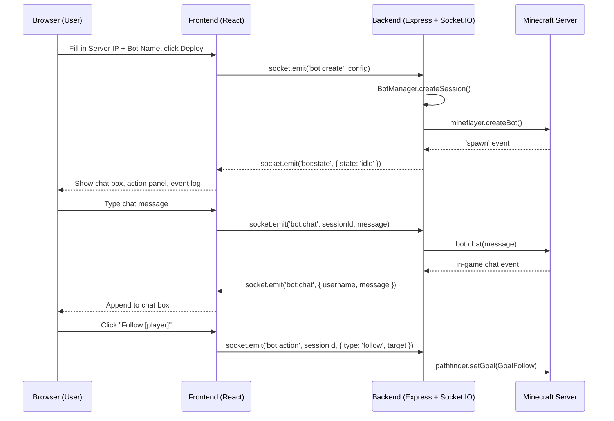

# Kanabot

> Minecraft-bot-as-a-service — spawn helper bots into any Minecraft server from your browser.

## Overview

Kanabot is a web platform that lets Minecraft players deploy, configure, and control helper bots via a browser dashboard. No setup required — just enter a server IP and click Deploy.

---

## Architecture

```
KANABOT/
├── backend/                    # Node.js + TypeScript API & Bot Manager
│   ├── src/
│   │   ├── index.ts            # Express + Socket.IO server entry point
│   │   ├── types.ts            # Shared TypeScript types
│   │   ├── botManager.ts       # Manages all active bot sessions
│   │   └── botSession.ts       # Individual bot: state machine, abilities, lifecycle
│   ├── .env.example
│   ├── .nvmrc                  # Node.js v24.15.0
│   ├── package.json
│   └── tsconfig.json
│
├── frontend/                   # React + TypeScript (Vite)
│   ├── src/
│   │   ├── main.tsx            # React entry point
│   │   ├── App.tsx             # Router setup
│   │   ├── types.ts            # Shared frontend types
│   │   ├── index.css           # Global styles & color palette
│   │   ├── pages/
│   │   │   ├── LandingPage.tsx # Simple landing with link to dashboard
│   │   │   └── DashboardPage.tsx # Main control panel
│   │   ├── components/
│   │   │   ├── BotDeployForm.tsx  # Deploy form (host, name, version)
│   │   │   ├── ChatBox.tsx        # Real-time in-game chat mirror
│   │   │   ├── EventLog.tsx       # Terminal-style event log
│   │   │   ├── ActionPanel.tsx    # Follow / Guard / Stop controls
│   │   │   └── AdBanner.tsx       # Ad placement placeholder
│   │   └── hooks/
│   │       └── useBotSession.ts   # Socket.IO state & actions hook
│   ├── index.html
│   ├── vite.config.ts
│   └── package.json
│
├── legacy/                     # Previous prototype (do not reference)
├── tmp/                        # Product briefs & feature specs
├── run_all.sh                  # One-command local dev launcher (backend + frontend)
├── spec.md                     # Formal technical specification
├── CHANGELOG.md                # Version history
└── .cursorrules
```

### Data Flow


```mermaid
sequenceDiagram
    participant U as Browser (User)
    participant F as Frontend (React)
    participant B as Backend (Express + Socket.IO)
    participant MC as Minecraft Server

    U->>F: Fill in Server IP + Bot Name, click Deploy
    F->>B: socket.emit('bot:create', config)
    B->>B: BotManager.createSession()
    B->>MC: mineflayer.createBot()
    MC-->>B: 'spawn' event
    B-->>F: socket.emit('bot:state', { state: 'idle' })
    F-->>U: Show chat box, action panel, event log

    U->>F: Type chat message
    F->>B: socket.emit('bot:chat', sessionId, message)
    B->>MC: bot.chat(message)

    MC-->>B: in-game chat event
    B-->>F: socket.emit('bot:chat', { username, message })
    F-->>U: Append to chat box

    U->>F: Click "Follow [player]"
    F->>B: socket.emit('bot:action', sessionId, { type: 'follow', target })
    B->>MC: pathfinder.setGoal(GoalFollow)
```

---

## Bot State Machine

```
disconnected ──spawn──► spawning ──success──► idle ◄──stop task──┐
      ▲                                          │                │
      │                                      start task           │
      │                                          ▼                │
      └──disconnect / idle timeout────────── task ───────────────┘
                                                 │
                                              dead (on bot death)
```

**States:**
- `disconnected` — no active connection to Minecraft server
- `spawning` — attempting to connect
- `idle` — connected, waiting for instructions
- `task` — executing `follow` or `guard` (only one task at a time)
- `dead` — bot was killed in-game (auto-reconnect attempted)

---

## Getting Started

### Prerequisites

- [nvm](https://github.com/nvm-sh/nvm) installed
- Node.js v24.15.0 (managed via `.nvmrc`)

### One-command startup (recommended)

```bash
bash run_all.sh
```

`run_all.sh` automatically:
1. Sources nvm and switches to Node.js 24.15.0 (installs it if missing)
2. Runs `npm install` in both `backend/` and `frontend/` if `node_modules` is absent
3. Copies `.env.example → .env` for each side if no `.env` exists yet
4. Starts both dev servers in parallel
5. Shuts both down cleanly on `Ctrl+C`

| Service | URL |
|---|---|
| Frontend | http://localhost:5173 |
| Backend API | http://localhost:3001 |
| Health check | http://localhost:3001/health |

---

### Manual startup

#### Backend

```bash
cd backend
nvm use
npm install
cp .env.example .env
npm run dev
```

#### Frontend

```bash
cd frontend
npm install
cp .env.example .env
npm run dev
```

---

## Environment Variables

### Backend (`backend/.env`)

```
PORT=3001
CORS_ORIGIN=http://localhost:5173
```

### Frontend (`frontend/.env`)

```
VITE_BACKEND_URL=http://localhost:3001
```

---

## MVP Features

- **Deploy bot** to any offline-mode Minecraft server
- **Real-time chat** — mirror in-game chat; send messages from browser
- **Follow** — bot follows a specified player within 5 blocks
- **Guard** — bot follows a player and attacks hostile mobs within 10 blocks
- **Stop** — cancel current task, return to idle
- **Event log** — terminal-style stream of bot lifecycle events
- **Auto idle timeout** — bot disconnects after 10 min of inactivity
- **Retry logic** — reconnects on unexpected disconnect (up to 5 attempts)

---

## Tech Stack

| Layer | Technology |
|---|---|
| Backend runtime | Node.js 24.15.0 |
| Backend framework | Express + Socket.IO |
| Bot engine | mineflayer + mineflayer-pathfinder |
| Frontend framework | React 18 + TypeScript |
| Frontend build | Vite |
| Real-time | Socket.IO (WebSocket) |
| Language | TypeScript (both ends) |
