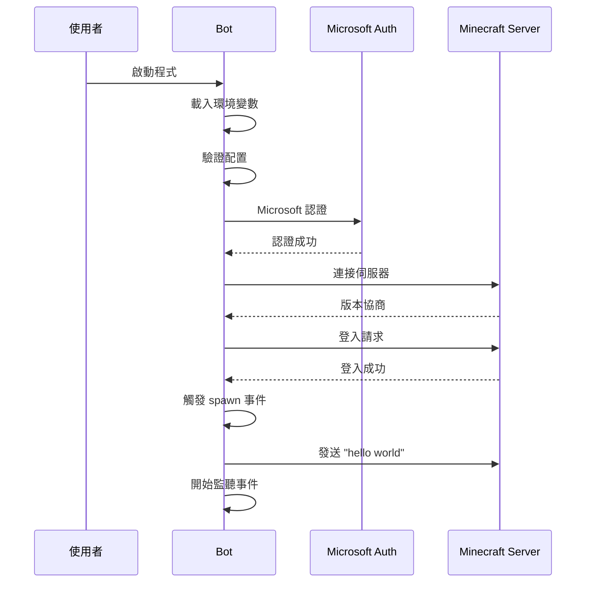

# AIK Minecraft Bot - 專案規格文件

## 📋 專案資訊

- **專案名稱**: AIK Minecraft Bot
- **版本**: 1.0.0
- **建立日期**: 2025-01-27
- **最後更新**: 2025-01-27
- **開發語言**: JavaScript (ES Modules)
- **運行環境**: Node.js 21+

## 🎯 專案目標

建立一個功能完整、易於使用的 Minecraft 機器人，具備以下核心功能：
1. Microsoft 帳號認證登入
2. 自動 Minecraft 版本偵測
3. 基本聊天功能（登入後發送 "hello world"）
4. 穩定的錯誤處理和重連機制

## 🔧 技術規格

### 開發環境要求
- **Node.js**: 22.17.1 (透過 .nvmrc 檔案指定)
- **npm**: >= 10.0.0
- **作業系統**: Windows、macOS、Linux
- **版本管理**: 使用 `nvm use` 確保版本一致性

### 依賴套件
```json
{
  "dependencies": {
    "mineflayer": "^4.30.0",
    "dotenv": "^16.4.1"
  },
  "devDependencies": {
    "nodemon": "^3.0.3"
  }
}
```

### 模組系統
- **類型**: ES Modules
- **導入方式**: `import/export`
- **檔案副檔名**: `.js`

## 📊 系統架構

### 模組結構
```
index.js
├── 配置管理 (Config Management)
├── 認證處理 (Authentication)
├── Bot 生命週期 (Bot Lifecycle)
├── 事件處理 (Event Handling)
└── 日誌系統 (Logging System)
```

### 資料流程圖


## 🔐 認證規格

### Microsoft 認證流程
1. **認證方式**: Microsoft Account OAuth
2. **所需資訊**:
   - Email: Microsoft 帳號郵箱
   - Password: Microsoft 帳號密碼
3. **認證結果**: 獲得有效的 Minecraft 存取 token
4. **錯誤處理**: 自動重試機制和明確錯誤訊息

### 支援的帳號類型
- Microsoft 個人帳號
- Microsoft 工作或學校帳號（如果擁有 Minecraft）
- Xbox Live 帳號

## 🌐 連線規格

### 伺服器連線
- **預設主機**: localhost
- **預設端口**: 25565
- **協定**: Minecraft Java Edition Protocol
- **版本支援**: 自動偵測（1.8 - 1.21）

### 錯誤處理機制
- **處理方式**: 記錄錯誤並停止運行
- **錯誤分類**:
  - 認證錯誤: 立即停止並顯示詳細說明
  - 連線錯誤: 記錄錯誤並提供解決建議
  - 其他錯誤: 記錄錯誤訊息
- **重連方式**: 手動重新啟動（避免干擾認證流程）

## 📝 功能規格

### 基本功能
1. **登入功能**
   - Microsoft 帳號認證
   - 自動版本協商
   - 成功登入後生成在世界中

2. **聊天功能**
   - 登入後 1 秒發送 "hello world"
   - 監聽並記錄所有聊天訊息
   - 忽略自己發送的訊息

3. **持續看向最近玩家功能** ⭐ NEW
   - 使用 `bot.on('physicsTick')` 事件（專門處理物理相關操作）
   - 可擴展設計：支援多個需要 physicsTick 觸發的功能共用同一個監聽器
   - 使用 `bot.nearestEntity()` API 直接查找最近的玩家或生物實體
   - 智慧過濾：支援玩家 (`entity.type === 'player'`) 和生物 (`entity.type === 'mob'`)
   - 動態高度計算：使用 `playerEntity.height * 0.75` 計算看向位置
   - 簡潔實作：移除複雜的狀態管理和日誌記錄，專注核心功能
   - 高效能：直接調用 `bot.lookAt()` 無額外處理層級
   - 錯誤容錯：避免 physicsTick 事件中的錯誤影響 bot 整體運作

4. **事件處理**
   - `spawn`: 成功生成後的處理
   - `chat`: 聊天訊息監聽
   - `kicked`: 被踢出處理
   - `error`: 錯誤處理
   - `end`: 連線結束處理
   - `login`: 登入過程處理
   - `tick`: 持續看向最近玩家 ⭐ NEW

5. **傳送點系統** ⭐ NEW
   - **註冊指令**: `bot register tp <x> <y> <z> <name>`
     - 支援正負座標值和小數點座標
     - 不區分大小寫的名稱處理
     - 智慧覆蓋：重複名稱會更新座標而非錯誤
     - 即時反饋：成功註冊或更新時的確認訊息
   - **傳送指令**: `bot tp <name>` (不區分大小寫)
     - 自動查找已註冊的傳送點
     - 執行 `/tp <x> <y> <z>` 指令進行傳送
     - 友善錯誤處理：未找到目的地時提供使用說明
   - **資料管理**:
     - 使用模組級別的 `Map` 資料結構安全存儲傳送點
     - 避免污染 bot 實例屬性，防止與 mineflayer 內部屬性衝突
     - 完整的元資料記錄：註冊者、註冊時間
     - 記憶體存儲：bot 重啟後需重新註冊
   - **安全性**:
     - 僅接受聊天中的指令，無外部 API 介面
     - 指令格式嚴格驗證，防止惡意輸入
     - 詳細的操作日誌記錄

### 日誌功能
- **格式**: `[時間戳] [等級] 訊息內容`
- **時間格式**: ISO 8601 (YYYY-MM-DDTHH:mm:ss.sssZ)
- **日誌等級**: INFO, ERROR
- **輸出位置**: 控制台

### 錯誤處理
- **認證錯誤**: 立即停止程式並顯示詳細解決方案
- **連線錯誤**: 記錄錯誤並提供配置建議，手動重啟
- **未知錯誤**: 記錄錯誤訊息，建議手動檢查後重啟

## 📋 環境變數規格

### 必要變數
| 變數名稱 | 類型 | 預設值 | 說明 |
|---------|------|--------|------|
| `MINECRAFT_EMAIL` | String | 無 | Microsoft 帳號郵箱 |
| `MINECRAFT_PASSWORD` | String | 無 | Microsoft 帳號密碼 |

### 可選變數
| 變數名稱 | 類型 | 預設值 | 說明 |
|---------|------|--------|------|
| `MINECRAFT_SERVER_HOST` | String | "localhost" | 目標伺服器地址 |
| `MINECRAFT_SERVER_PORT` | Number | 25565 | 目標伺服器端口 |
| `BOT_USERNAME` | String | "MyBot" | Bot 暱稱 |
| `LOG_LEVEL` | String | "info" | 日誌等級 |

## 🔧 API 介面

### mineflayer Bot 配置
```javascript
const config = {
    email: process.env.MINECRAFT_EMAIL,
    password: process.env.MINECRAFT_PASSWORD,
    host: process.env.MINECRAFT_SERVER_HOST || 'localhost',
    port: parseInt(process.env.MINECRAFT_SERVER_PORT) || 25565,
    username: process.env.BOT_USERNAME || 'MyBot',
    auth: 'microsoft'
    // version 自動偵測
};
```

### 主要函式

#### `log(level, message)`
- **功能**: 格式化日誌輸出
- **參數**:
  - `level` (String): 日誌等級
  - `message` (String): 日誌訊息
- **輸出**: 格式化的時間戳日誌

#### `validateConfig()`
- **功能**: 驗證必要的環境變數
- **回傳**: void
- **副作用**: 如果配置無效則終止程式

#### `createBot()`
- **功能**: 建立並配置 mineflayer bot 實例
- **回傳**: Bot 實例
- **副作用**: 註冊所有事件監聽器

#### `main()`
- **功能**: 程式主進入點
- **回傳**: void
- **副作用**: 啟動整個 bot 系統

#### `lookAtNearestPlayer(bot)` ⭐ NEW (修正版)
- **功能**: 執行一次看向最近玩家或生物的邏輯（由統一 physicsTick 監聽器呼叫）
- **參數**: 
  - `bot` (Object): mineflayer bot 實例
- **實作方式**: 
  - 使用 `bot.nearestEntity()` 直接查找最近的玩家或生物
  - 動態計算目標高度位置 (`entity.height * 0.75`)
  - 立即執行 `bot.lookAt()` 無額外處理
- **過濾條件**: 支援玩家 (`entity.type === 'player'`) 和生物 (`entity.type === 'mob'`)
- **回傳**: void
- **效能**: 極簡實作，與 Minecraft physicsTick 同步
- **特點**: 
  - 無狀態管理，每次都重新查找
  - 無日誌記錄，專注核心功能
  - 支援多種實體類型

#### 統一 PhysicsTick 事件架構 ⭐ NEW (修正版)
- **位置**: `bot.on('spawn')` 事件中註冊
- **事件類型**: `bot.on('physicsTick')` - 專門處理物理相關操作
- **設計目標**: 支援多個需要 physicsTick 觸發的功能
- **擴展性**: 可輕易加入其他物理相關功能（如移動、跳躍、碰撞檢測）
- **錯誤處理**: 統一的 try-catch 包裝，避免單一功能錯誤影響整體
- **效能**: 比一般 tick 更適合物理操作，減少不必要的計算

#### 傳送點系統 API ⭐ NEW

#### `teleportDestinations` ⭐ NEW
- **類型**: `Map<string, Object>`
- **作用域**: 模組級別常數
- **功能**: 全域傳送點存儲，避免污染 bot 實例
- **key 格式**: 傳送點名稱的小寫版本
- **value 格式**: `{ x, y, z, originalName, registeredBy, registeredAt }`
- **安全性**: 與 mineflayer 內部屬性完全隔離

#### `tickErrorLoggedBots` ⭐ NEW  
- **類型**: `WeakSet<Object>`
- **作用域**: 模組級別常數
- **功能**: 記錄已顯示 tick 錯誤的 bot 實例，避免重複錯誤日誌
- **特點**: 使用 WeakSet 自動垃圾回收，不阻止 bot 實例被釋放
- **安全性**: 避免在 bot 實例上添加 `_tickErrorLogged` 屬性

#### `parseTeleportRegisterCommand(message)` ⭐ NEW
- **功能**: 解析傳送點註冊指令格式
- **參數**: 
  - `message` (String): 聊天訊息內容
- **回傳**: Object|null - 成功時回傳 `{ x, y, z, name }`，失敗時回傳 null
- **格式**: `bot register tp <x> <y> <z> <name>`
- **驗證**: 座標值必須為有效數字（支援負數和小數點）
- **特點**: 使用正規表達式進行嚴格格式驗證

#### `registerTeleportDestination(bot, x, y, z, name, playerName)` ⭐ NEW
- **功能**: 註冊或更新傳送點
- **參數**: 
  - `bot` (Object): mineflayer bot 實例
  - `x, y, z` (Number): 傳送目標座標
  - `name` (String): 傳送點名稱
  - `playerName` (String): 註冊操作的玩家名稱
- **回傳**: void
- **副作用**: 
  - 在模組級別的 `teleportDestinations` Map 中存儲傳送點
  - 發送確認訊息到聊天頻道
  - 記錄操作日誌
- **特點**: 支援覆蓋已存在的傳送點，使用安全的模組級別變數存儲

#### `parseTeleportCommand(message)` ⭐ NEW
- **功能**: 解析傳送指令格式
- **參數**: 
  - `message` (String): 聊天訊息內容
- **回傳**: String|null - 成功時回傳傳送點名稱，失敗時回傳 null
- **格式**: `bot tp <name>`
- **特點**: 不區分大小寫，使用正規表達式驗證

#### `teleportToDestination(bot, destinationName, playerName)` ⭐ NEW
- **功能**: 執行傳送到指定目的地
- **參數**: 
  - `bot` (Object): mineflayer bot 實例
  - `destinationName` (String): 目的地名稱
  - `playerName` (String): 請求傳送的玩家名稱
- **回傳**: void
- **副作用**: 
  - 從模組級別的 `teleportDestinations` Map 查找傳送點
  - 執行 `/tp` 指令並發送結果訊息到聊天頻道
  - 記錄操作日誌
- **錯誤處理**: 未找到目的地時提供友善的錯誤訊息和使用說明

#### `handleTeleportCommands(bot, username, message)` ⭐ NEW
- **功能**: 統一處理所有傳送相關的聊天指令
- **參數**: 
  - `bot` (Object): mineflayer bot 實例
  - `username` (String): 發送訊息的玩家名稱
  - `message` (String): 聊天訊息內容
- **回傳**: Boolean - 是否處理了傳送指令
- **整合點**: 在 `bot.on('chat')` 事件監聽器中調用
- **特點**: 
  - 統一的指令分派邏輯
  - 忽略 bot 自己的訊息
  - 按優先順序處理註冊和傳送指令

## 🚨 已知問題與限制

### Mineflayer 聊天功能崩潰 (Critical Issue)

**問題 ID**: [mineflayer/issues/3703](https://github.com/PrismarineJS/mineflayer/issues/3703)

**影響功能**: 聊天訊息監聽和傳送點系統

**技術細節**:
- **錯誤類型**: `TypeError [ERR_INVALID_ARG_TYPE]`
- **錯誤位置**: `minecraft-protocol/src/client/chat.js:61:114`
- **根本原因**: `Buffer.concat()` 預期接收 Array，但實際收到 Buffer
- **觸發條件**: Bot 處理第二次及後續聊天訊息時

**影響版本**:
- mineflayer: 4.30.0
- minecraft-protocol: 相關依賴版本
- Node.js: 22.17.1

**當前解決狀態**:
```javascript
// 目前狀態：聊天監聽器已暫時停用
// bot.on('chat', (username, message) => {
//     // 傳送點系統功能暫時無法使用
//     handleTeleportCommands(bot, username, message);
// });
```

**臨時修復方案** (來自社群貢獻):
```javascript
// 修改 node_modules/minecraft-protocol/src/client/chat.js 第 61 行
const acknowledgements = previousMessages.length > 0 ? 
  ['i32', previousMessages.length, 'buffer', 
   Buffer.concat(previousMessages.map(msg => msg.signature || client._signatureCache[msg.id])
   .filter(buf => Buffer.isBuffer(buf)))] : ['i32', 0]
```

**風險評估**:
- **高風險**: 直接修改 node_modules 會在重新安裝依賴時丟失
- **中風險**: 可能影響其他使用 minecraft-protocol 的功能
- **低風險**: 僅影響聊天功能，其他功能正常

**替代方案**:
1. **暫時停用** (目前採用): 確保 bot 穩定性，但失去聊天功能
2. **版本降級**: 使用較舊版本的 mineflayer
3. **自定義 fork**: 建立專案專用的修復版本

**監控狀態**: 
- ⏳ 等待官方修復
- 📋 已記錄在專案文檔中
- 🔍 持續關注相關 GitHub issue 更新

**對專案的影響**:
- ❌ 傳送點系統功能暫時無法使用
- ❌ 聊天訊息監聽功能停用
- ✅ 其他所有功能正常運作
- ✅ Bot 穩定性得到保障

## 📈 版本歷史

### v1.2.2 (2025-01-27) 🚨 關鍵問題處理
- 🚨 發現：mineflayer 4.30.0 聊天功能崩潰問題 ([issue #3703](https://github.com/PrismarineJS/mineflayer/issues/3703))
- 🛡️ 暫時措施：停用聊天監聽器確保 bot 穩定性
- ❌ 功能影響：傳送點系統暫時無法使用
- 📝 文檔更新：詳細記錄問題、原因和解決方案
- 🔍 監控：持續關注官方修復進度
- 💡 社群方案：記錄 minecraft-protocol 庫的臨時修復程式碼
- 📋 風險評估：完整分析各種解決方案的利弊

### v1.2.1 (2025-01-27) 🔒 安全性修正
- 🔒 修正：改用模組級別的 `teleportDestinations` Map 存儲傳送點
- 🔒 修正：改用 `WeakSet` 記錄 tick 錯誤狀態，取代 `bot._tickErrorLogged` 屬性
- 🔒 移除對 bot 實例屬性的直接修改，避免與 mineflayer 內部屬性衝突
- 🔒 提升程式碼安全性，防止意外覆蓋 bot 原生屬性
- 🔧 保持所有功能不變，純粹的內部架構改進

### v1.2.0 (2025-01-27) 🚀 傳送點系統
- ✅ 新增完整的傳送點系統
- ✅ 傳送點註冊功能：`bot register tp <x> <y> <z> <name>`
  - 支援正負座標值和小數點座標
  - 不區分大小寫的名稱處理
  - 智慧覆蓋機制，避免重複註冊錯誤
- ✅ 傳送功能：`bot tp <name>` (不區分大小寫)
  - 自動查找已註冊的傳送點
  - 執行遊戲內 `/tp` 指令
  - 友善的錯誤處理和使用說明
- ✅ 高效能資料管理：使用 Map 資料結構存儲傳送點
- ✅ 完整的元資料記錄：註冊者、註冊時間
- ✅ 嚴格的指令格式驗證，確保安全性
- ✅ 詳細的操作日誌和即時聊天反饋
- 🏗️ 整合到現有聊天系統，無侵入性設計

### v1.1.1 (2025-01-27) 🔧 重要修正
- ✅ 修正：改用 `bot.on('physicsTick')` 取代 `bot.on('tick')`，更適合物理相關操作
- ✅ 簡化：移除 `findNearestPlayer()` 函數，直接在 `lookAtNearestPlayer()` 中使用 `bot.nearestEntity()`
- ✅ 優化：移除複雜的狀態管理和日誌記錄，專注核心功能
- ✅ 增強：支援看向生物實體 (`entity.type === 'mob'`)，不僅限於玩家
- ✅ 改進：使用動態高度計算 (`entity.height * 0.75`) 取代固定偏移
- 🔧 架構：極簡化實作，提升效能和可維護性

### v1.1.0 (2025-01-27) ⭐ NEW
- ✅ 新增持續看向最近玩家功能
- ✅ 使用遊戲 tick 事件實現即時追蹤
- ✅ 智慧距離計算和目標切換
- ✅ 頭部精準追蹤 (Y+1.6 偏移)
- ✅ 錯誤容錯機制，避免影響 bot 運作
- 🔧 優化日誌輸出，減少重複訊息
- 🏗️ 重構為統一 tick 事件架構，支援多功能擴展
- 🏗️ 改進狀態管理，使用 bot 對象存儲狀態
- ⚡ 程式碼優化：使用 `bot.nearestEntity()` API 取代手動距離計算，提升效能和可讀性

### v1.0.1 (2025-01-27)
- 🔧 移除自動重連機制，避免干擾認證流程
- 🔧 改為手動重新啟動模式
- 🔧 保留詳細錯誤診斷和解決建議
- 🔧 優化錯誤處理邏輯

### v1.0.0 (2025-01-27)
- ✅ Microsoft 帳號認證
- ✅ 自動版本偵測
- ✅ 基本聊天功能
- ✅ 錯誤處理和重連
- ✅ 結構化日誌系統
- ✅ 環境變數配置
- ✅ ES Modules 支援
- ✅ Node.js 版本控制 (.nvmrc)
- ✅ nodemon 開發模式支援
- ✅ 擴展的 npm 腳本