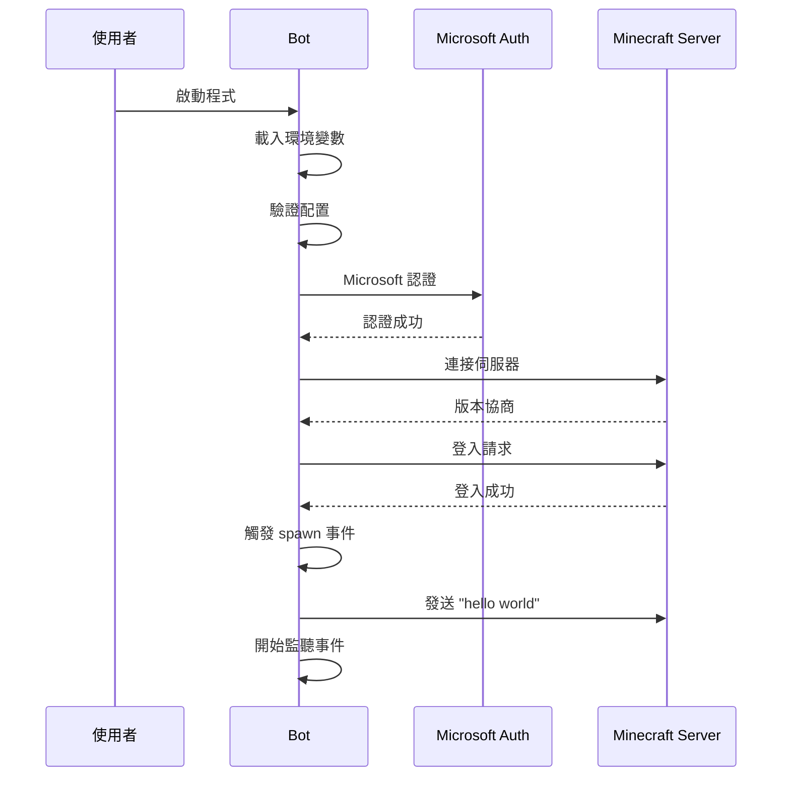

# AIK Minecraft Bot - 專案規格文件

## 📋 專案資訊

- **專案名稱**: AIK Minecraft Bot
- **版本**: 1.0.0
- **建立日期**: 2025-01-27
- **最後更新**: 2025-01-27
- **開發語言**: JavaScript (ES Modules)
- **運行環境**: Node.js 21+

## 🎯 專案目標

建立一個功能完整、易於使用的 Minecraft 機器人，具備以下核心功能：
1. Microsoft 帳號認證登入
2. 自動 Minecraft 版本偵測
3. 基本聊天功能（登入後發送 "hello world"）
4. 穩定的錯誤處理和重連機制

## 🔧 技術規格

### 開發環境要求
- **Node.js**: 22.17.1 (透過 .nvmrc 檔案指定)
- **npm**: >= 10.0.0
- **作業系統**: Windows、macOS、Linux
- **版本管理**: 使用 `nvm use` 確保版本一致性

### 依賴套件
```json
{
  "dependencies": {
    "mineflayer": "^4.30.0",
    "dotenv": "^16.4.1"
  },
  "devDependencies": {
    "nodemon": "^3.0.3"
  }
}
```

### 模組系統
- **類型**: ES Modules
- **導入方式**: `import/export`
- **檔案副檔名**: `.js`

## 📊 系統架構

### 模組結構
```
index.js
├── 配置管理 (Config Management)
├── 認證處理 (Authentication)
├── Bot 生命週期 (Bot Lifecycle)
├── 事件處理 (Event Handling)
└── 日誌系統 (Logging System)
```

### 資料流程圖


## 🔐 認證規格

### Microsoft 認證流程
1. **認證方式**: Microsoft Account OAuth
2. **所需資訊**:
   - Email: Microsoft 帳號郵箱
   - Password: Microsoft 帳號密碼
3. **認證結果**: 獲得有效的 Minecraft 存取 token
4. **錯誤處理**: 自動重試機制和明確錯誤訊息

### 支援的帳號類型
- Microsoft 個人帳號
- Microsoft 工作或學校帳號（如果擁有 Minecraft）
- Xbox Live 帳號

## 🌐 連線規格

### 伺服器連線
- **預設主機**: localhost
- **預設端口**: 25565
- **協定**: Minecraft Java Edition Protocol
- **版本支援**: 自動偵測（1.8 - 1.21）

### 錯誤處理機制
- **處理方式**: 記錄錯誤並停止運行
- **錯誤分類**:
  - 認證錯誤: 立即停止並顯示詳細說明
  - 連線錯誤: 記錄錯誤並提供解決建議
  - 其他錯誤: 記錄錯誤訊息
- **重連方式**: 手動重新啟動（避免干擾認證流程）

## 📝 功能規格

### 基本功能
1. **登入功能**
   - Microsoft 帳號認證
   - 自動版本協商
   - 成功登入後生成在世界中

2. **聊天功能**
   - 登入後 1 秒發送 "hello world"
   - 監聽並記錄所有聊天訊息
   - 忽略自己發送的訊息

3. **事件處理**
   - `spawn`: 成功生成後的處理
   - `chat`: 聊天訊息監聽
   - `kicked`: 被踢出處理
   - `error`: 錯誤處理
   - `end`: 連線結束處理
   - `login`: 登入過程處理

### 日誌功能
- **格式**: `[時間戳] [等級] 訊息內容`
- **時間格式**: ISO 8601 (YYYY-MM-DDTHH:mm:ss.sssZ)
- **日誌等級**: INFO, ERROR
- **輸出位置**: 控制台

### 錯誤處理
- **認證錯誤**: 立即停止程式並顯示詳細解決方案
- **連線錯誤**: 記錄錯誤並提供配置建議，手動重啟
- **未知錯誤**: 記錄錯誤訊息，建議手動檢查後重啟

## 📋 環境變數規格

### 必要變數
| 變數名稱 | 類型 | 預設值 | 說明 |
|---------|------|--------|------|
| `MINECRAFT_EMAIL` | String | 無 | Microsoft 帳號郵箱 |
| `MINECRAFT_PASSWORD` | String | 無 | Microsoft 帳號密碼 |

### 可選變數
| 變數名稱 | 類型 | 預設值 | 說明 |
|---------|------|--------|------|
| `MINECRAFT_SERVER_HOST` | String | "localhost" | 目標伺服器地址 |
| `MINECRAFT_SERVER_PORT` | Number | 25565 | 目標伺服器端口 |
| `BOT_USERNAME` | String | "MyBot" | Bot 暱稱 |
| `LOG_LEVEL` | String | "info" | 日誌等級 |

## 🔧 API 介面

### mineflayer Bot 配置
```javascript
const config = {
    email: process.env.MINECRAFT_EMAIL,
    password: process.env.MINECRAFT_PASSWORD,
    host: process.env.MINECRAFT_SERVER_HOST || 'localhost',
    port: parseInt(process.env.MINECRAFT_SERVER_PORT) || 25565,
    username: process.env.BOT_USERNAME || 'MyBot',
    auth: 'microsoft'
    // version 自動偵測
};
```

### 主要函式

#### `log(level, message)`
- **功能**: 格式化日誌輸出
- **參數**:
  - `level` (String): 日誌等級
  - `message` (String): 日誌訊息
- **輸出**: 格式化的時間戳日誌

#### `validateConfig()`
- **功能**: 驗證必要的環境變數
- **回傳**: void
- **副作用**: 如果配置無效則終止程式

#### `createBot()`
- **功能**: 建立並配置 mineflayer bot 實例
- **回傳**: Bot 實例
- **副作用**: 註冊所有事件監聽器

#### `main()`
- **功能**: 程式主進入點
- **回傳**: void
- **副作用**: 啟動整個 bot 系統

## 🧪 測試規格

### 手動測試項目
1. **環境設定測試**
   - [ ] Node.js 版本檢查
   - [ ] 依賴套件安裝
   - [ ] 環境變數載入

2. **認證測試**
   - [ ] 有效 Microsoft 帳號登入
   - [ ] 無效帳號處理
   - [ ] 網路連線問題處理

3. **連線測試**
   - [ ] 本地伺服器連線
   - [ ] 遠端伺服器連線
   - [ ] 無效伺服器處理

4. **功能測試**
   - [ ] 成功登入並發送 hello world
   - [ ] 聊天訊息監聽
   - [ ] 重連機制

### 預期行為
- **正常啟動**: 顯示歡迎訊息和配置資訊
- **成功連線**: 顯示 bot 位置和遊戲版本
- **聊天功能**: 1 秒後發送 "hello world" 並記錄
- **錯誤處理**: 明確的錯誤訊息和適當的重試

## 📊 效能指標

### 系統要求
- **記憶體使用**: < 100MB
- **CPU 使用**: < 5%（空閒時）
- **網路頻寬**: < 1KB/s（空閒時）

### 回應時間
- **啟動時間**: < 5 秒
- **登入時間**: < 10 秒
- **聊天回應**: < 1 秒

## 🔒 安全性規格

### 資料保護
- 密碼不以明文儲存在記憶體中
- 環境變數檔案 (.env) 不提交到版本控制
- 日誌中不記錄敏感資訊

### 存取控制
- 僅允許已配置的帳號登入
- 不接受外部命令輸入
- 不建立網路伺服器端點

## 📈 版本歷史

### v1.0.1 (2025-01-27)
- 🔧 移除自動重連機制，避免干擾認證流程
- 🔧 改為手動重新啟動模式
- 🔧 保留詳細錯誤診斷和解決建議
- 🔧 優化錯誤處理邏輯

### v1.0.0 (2025-01-27)
- ✅ Microsoft 帳號認證
- ✅ 自動版本偵測
- ✅ 基本聊天功能
- ✅ 錯誤處理和重連
- ✅ 結構化日誌系統
- ✅ 環境變數配置
- ✅ ES Modules 支援
- ✅ Node.js 版本控制 (.nvmrc)
- ✅ nodemon 開發模式支援
- ✅ 擴展的 npm 腳本

## 🚀 未來規劃

### 短期目標 (v1.1.0)
- [ ] 更多聊天指令支援
- [ ] 配置檔案支援
- [ ] 詳細錯誤分類

### 中期目標 (v1.2.0)
- [ ] Web 管理介面
- [ ] 多伺服器支援
- [ ] 插件系統

### 長期目標 (v2.0.0)
- [ ] TypeScript 重構
- [ ] 資料庫支援
- [ ] 叢集部署

## 📞 支援與維護

### 已知限制
1. 不支援 Minecraft Bedrock Edition
2. 需要正版 Microsoft 帳號
3. 不支援複雜的遊戲互動

### 故障排除
參見 README.md 中的故障排除章節

### 技術支援
- 檔案問題: 檢查 GitHub Issues
- 功能請求: 提交 Feature Request
- 安全問題: 私人聯絡維護者 